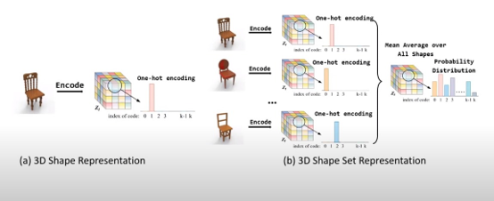
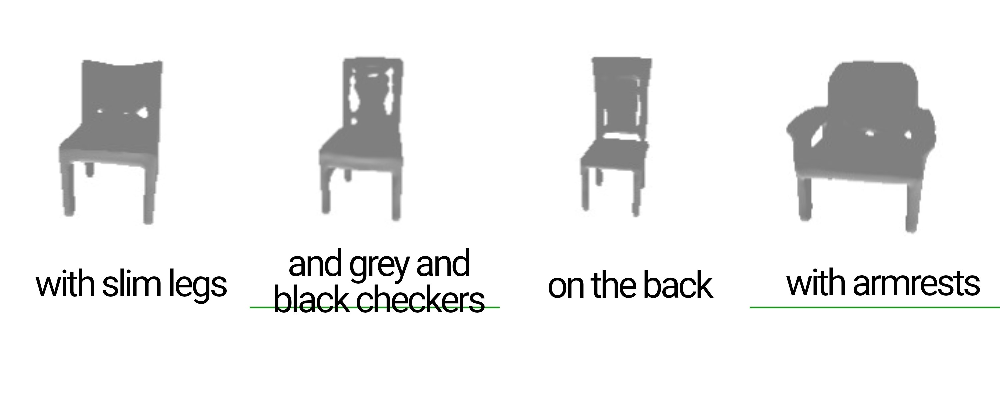
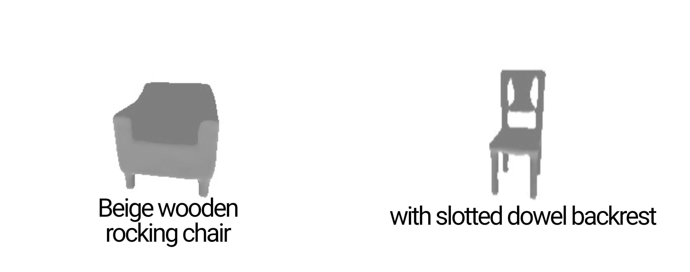
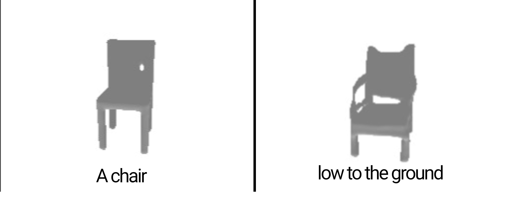

# ADL4CV — Text-Guided Multi-Instance 3D Shape Synthesis

> Generative pipeline for synthesizing 3D shapes from natural language descriptions using a VQ-VAE + Transformer architecture with BERT-based text conditioning, trained on ShapeNet SDFs.

Built as part of the **Advanced Deep Learning for Computer Vision** course (SS23) at TUM.



## Results

<p align="center">
  
  
  
</p>

## Architecture

| Component | Description |
|---|---|
| **Text Encoder** | Pretrained BERT (`bert-base-uncased`) with MLP projection mapping language embeddings to an 8³ grid |
| **Shape Encoder (PVQVAE)** | Vector-Quantized VAE compressing 64³ SDF grids into discrete codebook indices via patch-based encoding |
| **Transformer Decoder** | 12-layer, 12-head transformer with Fourier positional embeddings, predicting VQ codebook tokens |
| **Shape Decoder** | 3D convolutional decoder reconstructing 64³ SDF volumes from quantized latent codes |
| **Loss** | L1 reconstruction + VQ codebook commitment + optional LPIPS perceptual loss |
| **Metric** | Intersection-over-Union (IoU) on thresholded SDF outputs |

The system follows a two-stage approach:
1. **Stage 1** — Train the PVQVAE to learn a discrete codebook of 3D shape primitives
2. **Stage 2** — Train the Transformer conditioned on BERT text embeddings to predict codebook token sequences

## Project Structure

```
Project/src/
├── encoder/
│   ├── pvqae.py              # PVQVAE: patch-based VQ-VAE for 3D shapes
│   ├── text_projection.py    # BERT → MLP text encoder
│   └── train.py              # PVQVAE training script
├── models/
│   ├── transformer_networks/
│   │   ├── rand_transformer.py   # Autoregressive transformer decoder
│   │   └── pos_embedding.py      # Fourier positional embeddings
│   └── pvqvae_networks/         # 3D conv encoder/decoder, quantizer, losses
├── datasets/
│   ├── shape_net.py          # ShapeNet SDF dataloader
│   └── shape_net_z_sets.py   # Pre-extracted latent code loader
├── dataset_preprocessing/
│   ├── MeshToSDF/            # Mesh → SDF conversion pipeline
│   └── latent_code_extractor/ # Extract VQ codes from trained PVQVAE
├── configs/
│   ├── pvqae_configs.yaml    # PVQVAE architecture & training
│   ├── tansformer.yaml       # Transformer architecture
│   └── text_projection_configs.yaml
├── options/
│   └── base_options.py       # Training hyperparameters
└── utils/
    ├── qual_util.py          # Qualitative evaluation & mesh rendering
    ├── visualizer.py         # TensorBoard logging & image saving
    └── util.py               # General utilities
```

## Setup

```bash
cd Project
pip install -r requirements.txt
```

## Usage

**Stage 1 — Train PVQVAE**
```bash
cd Project/src
python encoder/train.py
```

**Stage 2 — Train Transformer**

Adjust configs in `configs/` and run the transformer training after PVQVAE convergence.

**Dataset Preprocessing**

To convert raw ShapeNet meshes to SDF format:
```bash
cd Project/src/dataset_preprocessing/MeshToSDF
python mesh_to_sdf.py
```

To extract latent codes from a trained PVQVAE:
```bash
cd Project/src/dataset_preprocessing/latent_code_extractor
python extract_shape_codes.py
```

## References

- [ShapeCrafter: A Recursive Text-Conditioned 3D Shape Generation Model](https://arxiv.org/abs/2207.09446)
- [AutoSDF: Shape Priors for 3D Completion, Reconstruction and Generation](https://arxiv.org/abs/2203.09516)
- [Neural Discrete Representation Learning (VQ-VAE)](https://arxiv.org/abs/1711.00937)

## Team

- **Youssef Youssef** — youssef.youssef@tum.de
- **Mustafa Sercan Amaç** — sercan.amac@tum.de
